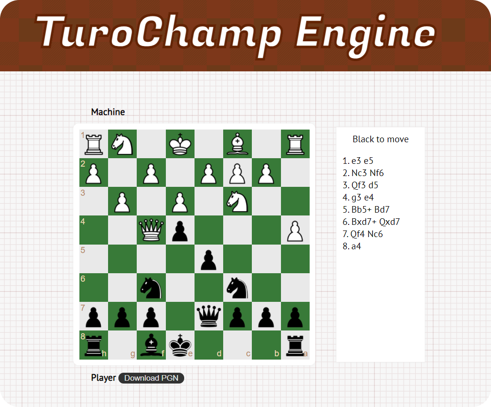

This is a browser based implementation of Alan Turing and David Champernowne's Turochamp chess engine, which they wrote in 1948.

For more information, do read the beautiful paper :-
https://docs.google.com/file/d/0B0xb4crOvCgTNmEtRXFBQUIxQWs

Also read the Chessbase article :- https://en.chessbase.com/post/reconstructing-turing-s-paper-machine

### Building the project

Dev build and starting a dev server.
```
npm run dev
``` 

Production Build
```
npm run build
```

Screenshot :-

